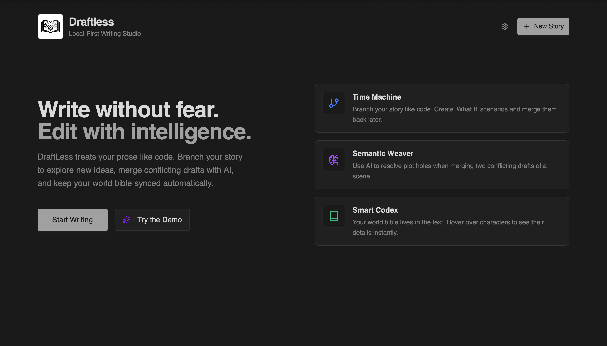

# DraftLess

**DraftLess** is a local-first, AI-augmented writing studio designed for non-linear storytelling. It treats prose like code, offering branching version control, semantic merging, and a self-documenting codex, all while keeping your data 100% local and offline-capable.



## 🚀 Core Features

### 1. 🕰️ Time Machine (Version Control)
Never lose an idea. DraftLess creates a graph-based history of your story.
- **Branching:** Create "Checkpoints" to explore alternative plotlines (e.g., "Stealth Approach" vs "Loud Approach") without destroying your main draft.
- **Graph View:** Visualize your story's evolution as a node graph.
- **Instant Restore:** Revert to any point in time with a single click.

### 2. ✨ Semantic Weaver (AI Merging)
Resolve conflicts between drafts using intelligence, not just diffs.
- **Smart Mix:** Blends two versions of a scene, resolving logic conflicts (e.g., "Glass broke" vs "Glass is whole").
- **Style Matching:** Rewrites new plot points to match your existing voice.
- **Powered by:** Google Gemini 2.5 Flash (via Vercel AI SDK).

### 3. 🧠 The Codex (Context Engine)
A built-in wiki that lives alongside your text.
- **Entity Tracking:** Define Characters, Locations, Items, and Lore.
- **Auto-Highlighting:** The editor automatically detects entity names in your text and creates hoverable context cards.
- **Data Isolation:** Every story has its own isolated Codex.

### 4. 📚 Project Management
- **Multi-Chapter Support:** Organize your novel into Chapters and Notes.
- **Split View:** Open two documents side-by-side for reference or rewriting.
- **Library Dashboard:** Manage multiple stories from a central hub.

### 5. 🔒 Local-First Architecture
Your data belongs to you.
- **Offline Ready:** Works 100% without internet (PWA).
- **IndexedDB:** All content is stored locally in your browser.
- **Data Export:** Compile your project into a single formatted Microsoft Word (`.doc`) or HTML file.

---

## 🛠️ Tech Stack

- **Frontend:** React + Vite + TypeScript
- **State Management:** Zustand + Yjs (CRDTs for conflict-free data)
- **Persistence:** IndexedDB (`idb` + `y-indexeddb`)
- **Editor:** Tiptap (Headless ProseMirror)
- **UI System:** Shadcn UI + Tailwind CSS (Monochrome OKLCH Theme)
- **AI:** Vercel AI SDK + Google Gemini

---

## ⚡️ Getting Started

### Prerequisites
- Node.js 18+
- A Google Gemini API Key (Get one [here](https://aistudio.google.com/))

### Installation

1. **Clone the repository**
   ```bash
   git clone [https://github.com/yourusername/draftless.git](https://github.com/yourusername/draftless.git)
   cd draftless