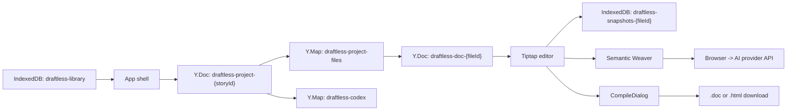

# Draftless Technical Architecture

This document explains how Draftless works as a running application.

## High-Level Summary

Draftless is a frontend-only React application. It uses three local persistence layers together:

- IndexedDB for top-level library metadata.
- Yjs documents persisted through `y-indexeddb` for story structure and file content.
- `localStorage` for UI preferences and AI provider credentials.

The app is organized around a simple hierarchy:

- Library
  A list of stories.

- Story
  A project-level Yjs document containing file metadata and codex data.

- File
  A chapter or note with its own Yjs-backed editor document.

- Snapshot
  A checkpoint stored in a dedicated IndexedDB database for one file.

## Runtime Diagram

## App Shell

The root flow lives in `src/App.tsx`.

The shell behavior is:

- If `currentDoc` is null, render the library dashboard.
- If `currentDoc` is set, create a story-scoped Yjs document.
- Create one Yjs document per open editor pane.
- Attach IndexedDB persistence to the story document and each open file document.

Important behavior in the app shell:

- Story structure is loaded from `draftless-project-{storyId}`.
- If a story is empty, Draftless auto-creates `Chapter 1`.
- The global library word count is updated every five seconds from the active editor's count.
- Split view uses separate Yjs documents for primary and secondary panes.

## State Management

Global UI state lives in the Zustand store in `src/lib/store.ts`.

The store tracks:

- Current story metadata.
- Active file ID.
- The current editor instance.
- Save/sync status.
- Word count.
- Split-view state.
- Primary and secondary file IDs.
- Active pane selection.

This store is intentionally UI-oriented. It does not hold the actual writing content. Content stays inside Yjs + Tiptap.

## Story Structure Model

Story-level structure is managed by `ProjectManager` in `src/lib/project.ts`.

Internally it uses:

- A Yjs map named `draftless-project-files`.

Each file record stores:

- `id`
- `title`
- `type`
- `order`
- `updatedAt`

The UI currently creates:

- `chapter`
- `note`

The type union also includes `folder`, but there is no visible UI using folders today.

## Editor Architecture

The editor is defined in `src/components/Editor.tsx`.

Draftless uses Tiptap with these extensions:

- `StarterKit`
- `Placeholder`
- `Collaboration`
- `BubbleMenu`
- `FloatingMenu`
- `Typography`
- `CharacterCount`
- `EntityHighlighter`
- `SuggestionAdd`
- `SuggestionDel`
- `CommentMark`

Important implementation details:

- Each open file gets its own `Y.Doc`.
- That `Y.Doc` is persisted with `IndexeddbPersistence`.
- The editor updates global word count only for the active pane.
- The editor instance is pushed into the global store so the sidebar and history tools can act on it.

Even though the editor uses Tiptap's collaboration extension and Yjs, the current app is still local-first and single-user in practice because there is no network provider.

## Sidebar Architecture

The sidebar in `src/components/Sidebar.tsx` is the main secondary workflow surface.

It exposes three tabs:

- `FilesView`
- `HistoryView`
- `CodexView`

### FilesView

FilesView reads the project-level Yjs file map and lets the user:

- Create chapters.
- Create notes.
- Open files into the active pane.
- Rename files.
- Delete files.

### HistoryView

HistoryView manages file-level checkpoints. It is backed by its own IndexedDB database per active file and renders:

- A list of checkpoints.
- A graph view using React Flow + Dagre.

It also sets the current checkpoint lineage through `currentParentId`, which becomes the parent for the next checkpoint.

### CodexView

CodexView manages project-level worldbuilding entries and writes them into the `draftless-codex` Yjs map.

## Codex Highlighting

Codex data is managed by `CodexManager` in `src/lib/codex.ts`.

There are two relevant behaviors:

- `CodexManager.scan()` does a simple case-insensitive substring search.
- The live editor highlighter in `EntityExtension.ts` does whole-word regex matching and applies ProseMirror decorations.

The actual editor hover behavior works like this:

1. Entity names are matched in text nodes.
2. Matches receive a decorated `span` with `entity-highlight` and `data-entity-id`.
3. `CodexHoverCard.tsx` listens for mouseover on those spans.
4. The matching codex entry is looked up and rendered in a hover card.

## Checkpoint and History Model

Checkpoints are stored outside Yjs in per-file IndexedDB databases.

HistoryView stores:

- `id`
- `timestamp`
- `description`
- `content`
- `parentId`

`content` is stored as Tiptap/ProseMirror-compatible JSON.

This gives the app two useful capabilities:

- Fast restore by calling `editor.commands.setContent(snapshot.content)`.
- DAG-based visualization in the graph view.

## AI Integration

The AI client lives in `src/lib/ai-client.ts`.

Provider selection is driven by `localStorage`:

- `google`
- `openai`
- `anthropic`

Current model wiring:

- Google: `gemini-2.5-flash`
- OpenAI: `gpt-4o`
- Anthropic: `claude-3-5-sonnet-20240620`

The three weave strategies are implemented as prompt templates:

- `mix`
- `action_b_tone_a`
- `append`

Important behavior:

- Prompts are assembled entirely in the client.
- Requests are sent directly from the browser.
- The returned text is treated as the final merged prose.
- Confirming a weave replaces the editor content rather than applying a granular patch.

## Export and Compile Pipeline

The compile workflow lives in `src/components/CompileDialog.tsx`.

Compile does the following:

1. Load all project files.
2. Filter to chapters only.
3. For each chapter, open the corresponding Yjs file doc through a temporary headless editor.
4. Convert that content to JSON.
5. Run `processContent()` to scrub or preserve review marks depending on export mode.
6. Stitch everything into one HTML document.
7. Download it as `.doc` or `.html`.

`processContent()` in `src/lib/content-processor.ts` currently supports three export modes:

- `final`
- `original`
- `review`

It understands:

- `suggestionAdd`
- `suggestionDel`
- `comment`

That means the export pipeline is more feature-ready than the editing UI currently exposed in the app.

## Settings, Theme, and PWA

Settings are split into two areas:

- Appearance
- Intelligence

Appearance uses `ThemeProvider` and stores the selected theme in `localStorage`.

Intelligence stores:

- Active AI provider
- Google API key
- OpenAI API key
- Anthropic API key

PWA behavior is configured in `vite.config.ts` via `vite-plugin-pwa`.

Important PWA details:

- The app auto-updates when a new version is deployed.
- Static assets are precached.
- The app is configured for standalone install.
- Safari uses a manual install instruction path.

## Styling System

The project uses:

- Tailwind CSS v4
- shadcn/ui-generated components
- Radix primitives

Theming is driven by CSS custom properties in `src/index.css`.

The design system is mostly monochrome with OKLCH-based tokens, with some component-level color accents for special workflows like history, codex types, and AI actions.

## Important Implementation Notes

These are worth knowing before making architectural decisions:

- There is no backend. All persistence is local to the browser.
- The "saved/offline" indicator reflects local IndexedDB/Yjs sync state, not remote collaboration.
- `src/lib/yjs-provider.ts` exists but is currently empty.
- `ExportDialog.tsx` exists, but it is not wired into the visible app flow.
- Review marks are supported as Tiptap marks and export filters, but there is no visible authoring UI for them in the current editor.
- File ordering exists in the data model but there is no drag-and-drop reordering UI today.

## Known Caveats

### Story deletion is only partially cleaned up

`library.delete()` removes the story metadata record and deletes:

- `draftless-doc-{storyId}`
- `draftless-snapshots-{storyId}`

But chapter docs and checkpoint databases are actually keyed by file ID, not story ID. That means deleting a story can leave orphaned file-level IndexedDB databases behind.

### Snapshot schema changes are destructive

HistoryView initializes the snapshots database with a versioned upgrade that recreates the `snapshots` object store. If the DB version is bumped in the future, existing checkpoints can be wiped during migration unless a real migration path is added.
